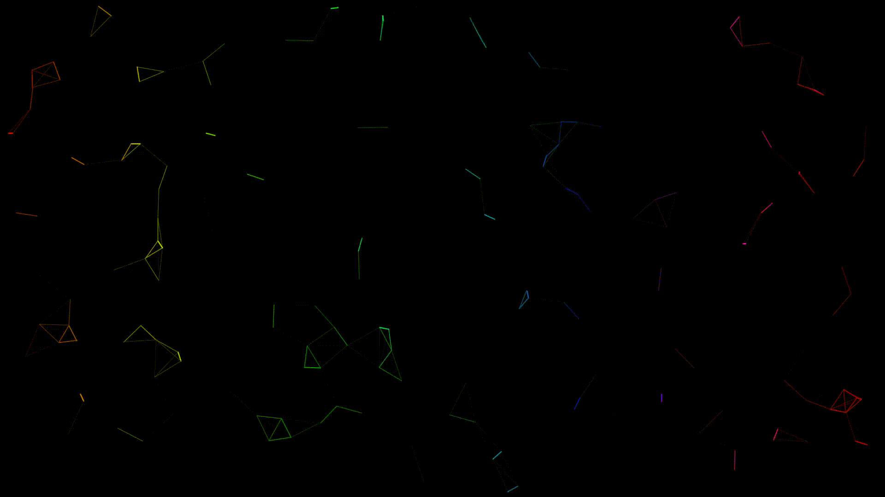

# Particle System based art
A while ago I made the base particle system with simple repelling forces based on [this video](https://www.youtube.com/watch?v=nfCoPSsAfHo). Then I modified the settings and added some extras, which created these nice patterns, that could work as a live wallpaper, or just some nice images in general.

